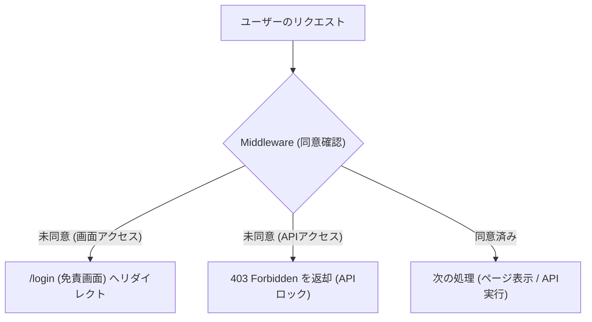
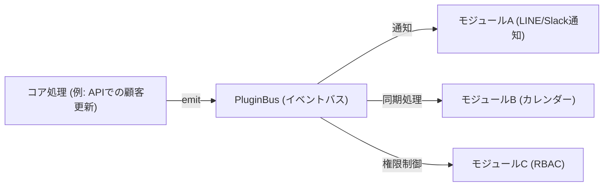

# 共通設計パターン ＆ 防衛アーキテクチャ仕様書 (BASEKIT_SPECIFICATION.md)

本仕様書は、手離れが良く、トラブルの起きない頑丈なWebシステム（特に知人や中小規模のクライアント向けシステム）を構築する際の**防衛設計パターン**および**再利用可能なアーキテクチャ**を定義したものです。

新規プロジェクト（第2弾ツール等）の開発を開始する際、**本仕様書をAIエージェントに読み込ませて開発を継続してください。**

---

## 1. 本仕様書の趣旨とAIへのプロンプト例

### 趣旨
AI共同開発においては、同じ防衛的コンセプト（免責同意の強制、確実な操作ログ、拡張性の確保）を毎回ゼロから再発明するのではなく、本ドキュメントに記載された標準コードパターンと設計ルールに準拠することで、ブレのない堅牢なシステムを短期間で構築します。

### AIへのプロンプト（新規プロジェクト用テンプレート）
> **[AIへの指示]**
> 新しいプロジェクト [プロジェクト名] を開始します。
> 設計・実装にあたっては、添付した `BASEKIT_SPECIFICATION.md` の「防衛設計パターン」および「再利用アーキテクチャ」に完全に準拠してください。
> 特に以下の防衛設計を必ず初期フェーズで組み込んでください：
> 1. 免責ゲートとMiddlewareによる二重ロック
> 2. PostgreSQLセッション変数とトリガーを用いた100%自動操作ログ
> 3. JSONBカスタムフィールドのセキュリティバリデーション
> 4. イベント駆動のノンブロッキング・プラグインバス

---

## 2. 免責ゲート ＆ 二重ロック仕様（自己防衛ゲート）

利用開始時に法的リスクを回避するための免責同意画面を表示し、同意していないユーザーによるアクセス（API直接実行を含む）を二重に遮断します。



### 技術仕様・実装コード（Next.js Middleware）
Cookie `crm_license_accepted_v{version}` の有無で判定します。APIルートとページアクセスで処理を分岐させます。

`src/middleware.ts` などの配置テンプレート：

```typescript
import { NextResponse } from 'next/server';
import type { NextRequest } from 'next/server';

export function middleware(request: NextRequest) {
  // 環境変数により同意チェック自体をバイパス可能にする（開発時用）
  const requireAgreement = process.env.NEXT_PUBLIC_REQUIRE_LICENSE_AGREEMENT === 'true';
  if (!requireAgreement) {
    return NextResponse.next();
  }

  const { pathname } = request.nextUrl;

  // 1. 除外パス（ログイン画面、静的ファイル、各種アセット）の判定
  if (
    pathname === '/login' ||
    pathname === '/favicon.ico' ||
    pathname.startsWith('/_next') ||
    pathname.match(/\.(css|js|png|jpg|jpeg|gif|svg|ico|woff|woff2)$/)
  ) {
    return NextResponse.next();
  }

  // 2. クッキーの存在・有効性検証（バージョンを環境変数から取得）
  const version = process.env.NEXT_PUBLIC_LICENSE_AGREEMENT_VERSION || '1.0.0';
  const cookieName = `crm_license_accepted_v${version}`;
  const acceptedCookie = request.cookies.get(cookieName);
  const isAccepted = acceptedCookie?.value === 'true';

  if (!isAccepted) {
    // APIリクエストの場合は JSON で 403 エラーを返し、バックエンド側でも二重ロックする
    if (pathname.startsWith('/api')) {
      return new NextResponse(
        JSON.stringify({
          success: false,
          error: '免責条項への同意が必要です。システム画面から同意してください。',
          code: 'LICENSE_AGREEMENT_REQUIRED',
        }),
        {
          status: 403,
          headers: { 'Content-Type': 'application/json' },
        }
      );
    }

    // 通常の画面アクセスの場合は免責ゲート（/login）へ強制リダイレクト
    const loginUrl = new URL('/login', request.url);
    return NextResponse.redirect(loginUrl);
  }

  return NextResponse.next();
}

export const config = {
  // すべてのリクエストに対して実行 (除外ロジックは内部で判定)
  matcher: '/:path*',
};
```

---

## 3. データベース監査ログ（自動操作ログ）仕様

アプリケーションコード内のログ記述漏れを防ぐため、データ変更ログの取得はデータベース（PostgreSQL）のトリガー機能に一任します。

### セッション変数の伝播クエリ
誰が操作したか（changed_by）を特定するため、アプリケーション側でDB接続（トランザクション）を開始した直後に、以下のクエリを実行して PostgreSQL セッション変数に操作ユーザーIDをセットします。

```typescript
// PostgreSQLセッション変数 app.current_user_id を設定 (プール接続でも動作する安全な記述)
await client.query("SELECT set_config('app.current_user_id', $1, true)", [operator]);
```

### データベースDDL ＆ トリガー関数定義 (PostgreSQL)

```sql
-- 1. 監査ログテーブル
CREATE TABLE audit_logs (
    id SERIAL PRIMARY KEY,
    customer_id INT NOT NULL,                                    -- 対象のエンティティID（例: 顧客ID）
    action VARCHAR(20) NOT NULL,                                 -- CREATE, UPDATE, DELETE
    changed_by VARCHAR(255) DEFAULT 'SYSTEM',                    -- セッションから取得する操作者
    old_data JSONB,                                              -- 変更前のレコード（JSONB）
    new_data JSONB,                                              -- 変更後のレコード（JSONB）
    changed_at TIMESTAMP WITH TIME ZONE DEFAULT CURRENT_TIMESTAMP
);

-- 2. 自動ロギング用トリガー関数（操作者の動的記録に対応）
CREATE OR REPLACE FUNCTION log_customer_changes()
RETURNS TRIGGER AS $$
DECLARE
    current_user_id VARCHAR(255);
BEGIN
    -- セッション変数から操作ユーザーIDを取得（設定されていなければ 'SYSTEM'）
    BEGIN
        current_user_id := current_setting('app.current_user_id', true);
    EXCEPTION WHEN OTHERS THEN
        current_user_id := 'SYSTEM';
    END;

    IF (current_user_id IS NULL OR current_user_id = '') THEN
        current_user_id := 'SYSTEM';
    END IF;

    -- INSERT（作成）時
    IF (TG_OP = 'INSERT') THEN
        INSERT INTO audit_logs(customer_id, action, changed_by, new_data)
        VALUES (NEW.id, 'CREATE', current_user_id, to_jsonb(NEW));
    
    -- UPDATE（更新）時
    ELSIF (TG_OP = 'UPDATE') THEN
        -- 変更がない場合はログを記録しない（パフォーマンス最適化）
        IF (OLD IS DISTINCT FROM NEW) THEN
            INSERT INTO audit_logs(customer_id, action, changed_by, old_data, new_data)
            VALUES (NEW.id, 'UPDATE', current_user_id, to_jsonb(OLD), to_jsonb(NEW));
        END IF;
    
    -- DELETE（物理削除）時
    ELSIF (TG_OP = 'DELETE') THEN
        INSERT INTO audit_logs(customer_id, action, changed_by, old_data)
        VALUES (OLD.id, 'DELETE', current_user_id, to_jsonb(OLD));
    END IF;
    
    RETURN NEW;
END;
$$ LANGUAGE plpgsql;

-- 3. トリガーの適用
CREATE TRIGGER customer_changes_trigger
AFTER INSERT OR UPDATE OR DELETE ON customers
FOR EACH ROW EXECUTE FUNCTION log_customer_changes();
```

---

## 4. 動的データ拡張（JSONBカスタムフィールド）仕様

カラムを動的に増やすための `JSONB` 型を採用しますが、悪意あるリクエストやバグによるリソース枯渇を防ぐため、API受付時に強力な防衛バリデーションを適用します。

### 防衛バリデーション仕様
1. **キー数の制限**: 最大50項目まで（大量キーによるインデックス破壊防止）
2. **ネスト（階層）制限**: 最大3階層まで（無限ネストによるパーサクラッシュ防止）
3. **データサイズ制限**: 最大64KB（65,536文字）まで（巨大データ送信によるメモリ枯渇防止）

### 実装コード（TypeScript / Next.js API）

```typescript
function validateCustomFields(customFields: any): { valid: boolean; error?: string } {
  if (customFields === undefined || customFields === null) {
    return { valid: true };
  }
  
  if (typeof customFields !== 'object' || Array.isArray(customFields)) {
    return { valid: false, error: 'カスタムフィールドはオブジェクト形式で指定してください。' };
  }

  // 1. キー数上限チェック（最大50項目）
  const keys = Object.keys(customFields);
  if (keys.length > 50) {
    return { valid: false, error: 'カスタムフィールドの項目数が多すぎます（最大50項目まで）。' };
  }

  // 2. ネスト（階層）深さチェック (最大3階層)
  function getDepth(obj: any): number {
    if (obj === null || typeof obj !== 'object') return 0;
    let maxDepth = 0;
    for (const key in obj) {
      if (Object.prototype.hasOwnProperty.call(obj, key)) {
        maxDepth = Math.max(maxDepth, getDepth(obj[key]));
      }
    }
    return 1 + maxDepth;
  }

  const depth = getDepth(customFields);
  if (depth > 3) {
    return { valid: false, error: 'カスタムフィールドのネスト階層が深すぎます（最大3階層まで）。' };
  }

  // 3. データサイズ上限チェック（最大64KB = 65,536文字）
  const jsonString = JSON.stringify(customFields);
  if (jsonString.length > 65536) {
    return { valid: false, error: 'カスタムフィールドのデータサイズが大きすぎます（最大64KBまで）。' };
  }

  return { valid: true };
}
```

---

## 5. 拡張モジュール設計（プラグインバス）仕様

コア機能を汚染せず、環境変数のON/OFFフラグだけでモジュールを「着せ替え」できるようにするため、疎結合なイベント駆動設計を採用します。



### プラグインバスの TypeScript 実装

`src/lib/plugin-bus.ts`：

```typescript
type EventListener = (data: any) => void | Promise<void>;

class PluginBus {
  private listeners: { [event: string]: EventListener[] } = {};

  /**
   * イベントにリスナーを登録
   */
  on(event: string, listener: EventListener) {
    if (!this.listeners[event]) {
      this.listeners[event] = [];
    }
    this.listeners[event].push(listener);
  }

  /**
   * イベントを発火（全リスナーを非同期で安全に実行）
   */
  async emit(event: string, data: any) {
    if (process.env.NODE_ENV !== 'production') {
      console.log(`[PluginBus] イベント発火: ${event}`, data);
    }
    const eventListeners = this.listeners[event] || [];

    // ✅ 【PersonalOpsKit v2で改善】直列実行(for...of)から並列実行に変更。
    // Promise.allSettled を使うことで、1つのリスナーが失敗しても他のリスナーが
    // キャンセルされず、かつAPIレスポンスをブロックしない。
    await Promise.allSettled(
      eventListeners.map(async (listener) => {
        try {
          await listener(data);
        } catch (err) {
          console.error(`イベント [${event}] のリスナー実行中にエラーが発生しました:`, err);
        }
      })
    );
  }
}

const pluginBus = new PluginBus();
export default pluginBus;
```

### モジュールの有効化・統合ルール
コアのAPI処理（例: 顧客の作成・変更）が完了した後、非同期でイベントを発行します。

```typescript
// 処理のコミット完了後、プラグインバスに通知 (呼び出し元の処理をブロックしない)
await pluginBus.emit('customer:update', updatedCustomer);
```

各モジュールは、環境変数が有効（`true`）の場合のみ、初期化時にプラグインバスのリスナーに登録する設計とします。

```typescript
// plugin-bus.ts 内での初期化例
if (process.env.ENABLE_MODULE_LINE_SLACK_NOTIFY === 'true') {
  registerNotificationPlugins(pluginBus);
}
```

---

## 6. 外部通信完全遮断スキャン仕様（PersonalOpsKit v2 逆輸入）

> **初出**: PersonalOpsKit（2棟目）にて実装・実戦検証済み。2026-06-22 逆輸入。

ソースコード内に外部通信（非許可の絶対URL・通信ライブラリ）が混入していないかを、ビルド前にNode.js製スクリプトで静的スキャンします。
Git BashやWSLに依存せず、**Windows PowerShell単体で動作**します。

### スキャン対象と検知パターン
- 対象拡張子：`.ts`, `.tsx`, `.js`, `.jsx`, `.css`
- 検知対象：`https://` または `http://` で始まる絶対URL（ただし `localhost` は除外）
- 検知対象：禁止外部ライブラリ（`require('axios')`, `import axios` 等）

### `check-no-network.js` の配置と実行

```jsonc
// package.json
{
  "scripts": {
    "test:security": "node check-no-network.js"
  }
}
```

```javascript
// check-no-network.js（骨格）
const fs = require('fs');
const path = require('path');

const SCAN_DIRS = ['src', 'app'];
const ALLOWED_PATTERNS = [/localhost/, /127\.0\.0\.1/];
const FORBIDDEN_LIBS = ['axios', 'node-fetch', 'got'];

// 再帰的にファイルを取得し、禁止パターンをチェック。
// 検出時は process.exit(1) でビルドを強制停止する。
```

> **適用判断**: ローカル隔離型PJでは必須。外部API連携が要件に含まれるPJでは、ホワイトリストを適切に設定したうえで適用する。

---

## 7. ローカルタイムゾーン日付処理パターン（PersonalOpsKit v2 逆輸入）

> **初出**: PersonalOpsKit（2棟目）にて実戦でバグ検出・修正済み。2026-06-22 逆輸入。

### 問題
Next.js + Prisma（SQLite/PostgreSQL）の組み合わせにおいて、`new Date().toISOString()` を使うと **UTC基準** で日付文字列が生成される。JSTでは午前0〜9時に前日扱いになる「日またぎバグ」が発生する。

### 正しいパターン

```typescript
// ❌ 危険: UTCベース。JST深夜0〜9時に日付がズレる
const dateStr = new Date().toISOString().slice(0, 10);

// ✅ 安全: ローカルタイムゾーン（JST）ベース
const dateStr = new Date().toLocaleDateString('sv-SE'); // → 'YYYY-MM-DD'

// ✅ 安全: 日付範囲クエリ（ローカル時間基準）
const startOfDay = new Date(`${dateStr}T00:00:00`);   // タイムゾーンサフィックスなし
const endOfDay   = new Date(`${dateStr}T23:59:59.999`);
```

### フロント側の売上・タスク月初末の計算

```typescript
// ❌ 危険
const startOfMonth = new Date(year, month, 1).toISOString().slice(0, 10);

// ✅ 安全: ローカル日付ヘルパー関数
const formatLocalDate = (d: Date) => {
  const y = d.getFullYear();
  const m = String(d.getMonth() + 1).padStart(2, '0');
  const day = String(d.getDate()).padStart(2, '0');
  return `${y}-${m}-${day}`;
};
const startOfMonth = formatLocalDate(new Date(year, month, 1));
const endOfMonth   = formatLocalDate(new Date(year, month + 1, 0));
```

---

## 8. Prisma型安全パターン（PersonalOpsKit v2 逆輸入）

> **初出**: PersonalOpsKit（2棟目）のコードレビューにて指摘・修正済み。2026-06-22 逆輸入。

### 問題
API内の `whereClause: any` はPrismaの型チェックを無効化し、誤ったフィールド名・型を渡してもコンパイル時に検出されない。

### 正しいパターン

```typescript
// ❌ 危険: any型でPrismaの型安全性が失われる
import { prisma } from '@/lib/prisma';
const whereClause: any = { userId };

// ✅ 安全: Prisma生成型を使用
import { Prisma } from '@prisma/client';
import { prisma } from '@/lib/prisma';

// モデルごとに対応する型を指定する
const whereClause: Prisma.TaskWhereInput    = { userId }; // tasks用
const whereClause: Prisma.RevenueWhereInput = { userId }; // revenues用
const whereClause: Prisma.CustomerWhereInput = { userId }; // customers用
```

Prismaが生成する `Prisma.XxxWhereInput` 型を使うことで、フィールド名のタイポや型不一致がコンパイル時に検出され、IDEの補完も有効になる。
