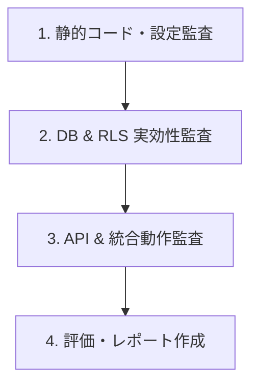

# 業務用SNSシステム 監査計画書 (AUDIT_PLAN.md)

本ドキュメントは、業務用SNSシステム（`business_sns_kit`）のセキュリティ、アクセス制御、監査ログ、自己防衛機能（免責ゲート）および外部連携の妥当性を検証・評価するための総合的な監査計画を定めたものです。

---

## 1. 監査の目的と基本方針

### 1.1 目的
* **不正アクセス・漏洩リスクの遮断**: 組織退職者やアクセス期限切れユーザーのアクセスを完全に遮断し、企業データの安全性を確保する。
* **100%の動作追跡可能性の担保**: 誰が・いつ・何の操作を行ったかを確実に追跡できる透過的な監査ログ構造を検証する。
* **自己防衛および法的リスクの回避**: 免責同意ゲートおよびAPI二重ロック機能により、システム提供側の過度な法的責任リスクを予防する。
* **外部連携の安全性確保**: Webhook受付APIやファイルストレージへの投稿権限・バリデーションの安全性を評価する。

### 1.2 基本方針
* **多層防御の検証**: フロントエンド（Next.js Middleware/画面制御）、バックエンド（APIルート）、データベース（PostgreSQL / Supabase RLS・トリガー）の各レイヤーで二重・三重の防御が機能しているかを評価する。
* **エビデンスに基づく評価**: 実際のDBトリガー発火、RLSポリシー実行、API疎通/遮断テストによる実効的な検証を行う。

---

## 2. 監査対象とコンポーネント範囲

| 対象領域 | 評価対象ファイル / データベース構造 |
| :--- | :--- |
| **アクセス制限 & RLS** | `schema.sql` (`plugin_user_ext_status`, `expires_at`, RLS Policy) |
| **免責・認可ゲート** | `src/middleware.ts`, `src/app/login/page.tsx`, `src/lib/auth.ts` |
| **API & Webhook** | `src/app/api/posts/route.ts`, `src/app/api/webhook/route.ts` |
| **自動操作ログ** | `schema.sql` (トリガー関数 `fn_sns_audit_log`, `plugin_sns_audit_logs`) |
| **拡張機能** | `src/modules/note-auth/` (noteメンバーシップ有効期限更新検証) |
| **外部通信・ネットワーク** | `check-no-network.js`, `.env.example` |

---

## 3. 監査チェックリスト (Audit Checklists)

### 3.1 認証・アクセスコントロール監査 (Access Control & RLS)
- [ ] **期限切れユーザーの拒否 (`expires_at`)**: `plugin_user_ext_status` の `expires_at` が過去日時の場合、Supabase RLS によりタイムライン投稿および取得が完全に拒否されるか。
- [ ] **退職者アクセスの即時遮断**: 管理者が `expires_at` を現在時刻以前に更新した場合、セッションが有効でもデータ読み書きが不可となるか。
- [ ] **RLS ポリシーの網羅性**: `plugin_sns_posts`, `plugin_sns_reactions` テーブルに対する SELECT / INSERT / UPDATE / DELETE すべてに適切な RLS ポリシーが適用されているか。
- [ ] **note認証モジュールの期限更新**: `src/modules/note-auth/` において、暗号トークン検証成功時のみ `expires_at` が正確に翌月末に更新されるか。

### 3.2 自己防衛・免責ゲート監査 (Disclaimer & API Double-Lock)
- [ ] **画面アクセスの強制リダイレクト**: クッキー `crm_license_accepted_v1.0.0` が存在しない場合、任意のダッシュボードページアクセス時に `/login`（免責画面）へリダイレクトされるか。
- [ ] **APIルートの二重ロック**: 未同意状態で `/api/posts` 等のAPIを直接コールした場合、HTTP 403 Forbidden および適切なエラーメッセージが返却されるか。
- [ ] **バイパス環境変数の制御**: 開発用の `NEXT_PUBLIC_REQUIRE_LICENSE_AGREEMENT=false` が本番環境で誤って有効化されない制御・構成になっているか。

### 3.3 監査ログ・トレーサビリティ監査 (100% Audit Logging)
- [ ] **全操作の自動記録**: 投稿の作成・削除・リアクション（いいね）付与時、PostgreSQLトリガー経由で `plugin_sns_audit_logs` にレコードが自動挿入されるか。
- [ ] **ログの正確性**: 操作ユーザーID、操作種別（INSERT/UPDATE/DELETE）、対象テーブル名、変更前後のJSONBデータが正しく保存されているか。
- [ ] **ログの不可変性 (Immutability)**: `plugin_sns_audit_logs` に対する UPDATE / DELETE 操作が、アプリ用DBユーザーおよび一般RLSで禁止されているか。

### 3.4 API & 外部連携セキュリティ監査 (API Security & Webhook)
- [ ] **Input Validation & Sanitization**: 投稿テキスト、添付ファイルURL、リアクション種別に対する文字列長制限およびスクリプトインジェクション対策（XSS/SQLi）が行われているか。
- [ ] **Webhook 認証と送信元検証**: `/api/webhook` が認証キー（`WEBHOOK_SECRET`等）の検証を行っており、不正な外部リクエストを拒否するか。
- [ ] **エラーハンドリングにおける情報漏洩**: APIエラー応答にスタックトレースやDB内部構造情報が含まれていないか。

### 3.5 静的セキュリティ・ネットワーク監査 (Static Security & Infrastructure)
- [ ] **環境変数の秘匿**: `.env.local` 等の秘密鍵（Supabase Service Role Key 等）が Git トラッキングから除外されているか（`.gitignore` の検証）。
- [ ] **外部不要通信の非混入**: `node check-no-network.js` を実行し、許可されていない外部ドメインへの非意図的なデータ送信やテレメトリが存在しないか。

---

## 4. 監査実施の手法と手順

### ステップ1: 静的コード・設定監査
1. `.env.example`, `.gitignore`, `package.json` の設定内容を確認。
2. ネットワーク通信チェッカー (`node check-no-network.js`) の実行。
3. コードベースの型チェックおよび静的解析の実施。

### ステップ2: DB & RLS 実効性監査
1. ローカル Supabase またはテスト環境 DB に `schema.sql` を適用。
2. テスト用ユーザーアカウント（有効期限内 / 期限切れ）を用意。
3. 期限切れユーザーのトークンを用いて SQL クエリを直接発行し、RLS によるブロックを実地検証。
4. 投稿操作を実行し、`plugin_sns_audit_logs` にログが自動生成されることをSQLで確認。

### ステップ3: API & 統合動作監査
1. API クライアント（またはテストスクリプト）を用いて `/api/posts` に対するリクエストを送信。
2. 免責同意クッキー「有・無」のそれぞれでレスポンス（200 OK / 403 Forbidden）を確認。
3. `/api/webhook` に対する無効なシークレットキーでのリクエストが拒否されることを確認。

---

## 5. 評価基準（欠陥重要度レベル）

| レベル | 定義 | 処置方針 |
| :--- | :--- | :--- |
| **Critical** | 期限切れ/退職ユーザーがデータ参照・書き込み可能、RLS欠損、認証バイパス | リリース即時差し止め。優先度最高で修正・再監査。 |
| **Major** | 監査ログの記録漏れ、免責APIロックの未適用、Webhook認証不備 | リリース前に必ず是正を要求。 |
| **Minor** | エラーメッセージの表記不備、軽微なドキュメントの差異 | 次期更新での是正または推奨改善事項とする。 |

---

## 6. 監査成果物および是正プロセス

1. **監査実行レポートの作成**:
   * 本計画書に基づき監査を実施後、結果を `AUDIT_REPORT.md`（または `ai_pipeline/test_report.md`）へ出力・報告する。
2. **不適合事項の修正および再検証**:
   * Critical / Major に分類された指摘事項については修正計画を作成し、是正確認テストを実施する。
3. **最終サインオフ**:
   * すべての Critical / Major 指摘事項が解消された時点で、監査適合判定を付与する。
